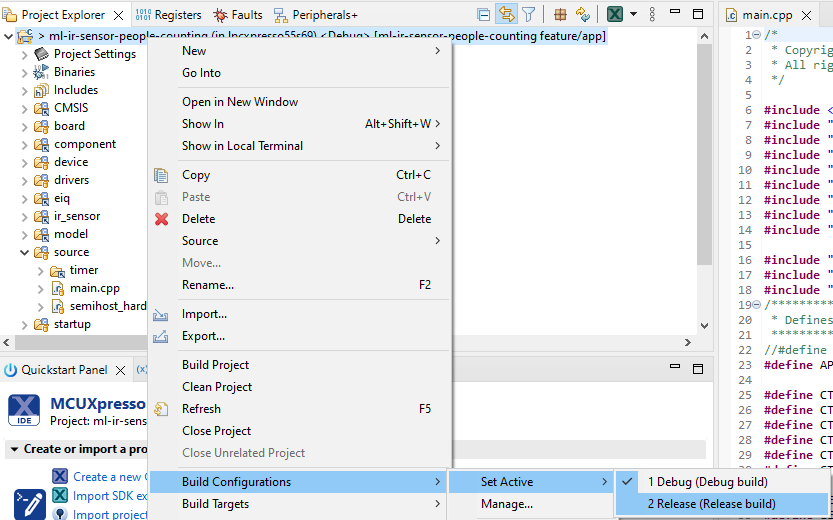

# NXP Application Code Hub

## Leveraging deep learning to count the number of people in a room using a low-resolution 8x8 infrared array sensor

This demo shows how to create a deep learning model to count the number of people in a room using a low-resolution 8x8 infrared array sensor.

#### Boards: LPCXpresso55S69, LPCXpresso55S28
#### Categories: AI/ML, Vision
#### Peripherals: I2C, SENSOR, UART, TIMER, CLOCKS
#### Toolchains: MCUXpresso IDE

## Table of Contents
1. [Software](#step1)
2. [Hardware](#step2)
3. [Setup](#step3)
4. [Results](#step4)
5. [FAQs](#step5)
6. [Support](#step6)
7. [Release Notes](#step7)

## 1. Software
* [MCUXpresso v11.8.0](https://nxp.com/mcuxpresso)
* LPCXpresso55S69 SDK from the [MCUXpresso SDK Builder](https://mcuxpresso.nxp.com/en/select) or from the [MCUXpresso SDK repository](https://github.com/nxp-mcuxpresso/mcux-sdk).
* [Python 3.11+](https://www.python.org/downloads/)
* [Jupyter notebook](https://jupyter.org/install) or [VS Code](https://code.visualstudio.com/docs/datascience/jupyter-notebooks)

## 2. Hardware
* [LPCXpresso55s69](https://www.nxp.com/design/software/development-software/mcuxpresso-software-and-tools-/lpcxpresso-boards/lpcxpresso55s69-development-board:LPC55S69-EVK)
* [LPCXpresso55s28](https://www.nxp.com/design/software/development-software/mcuxpresso-software-and-tools-/lpcxpresso-boards/lpcxpresso55s28-development-board:LPC55S28-EVK)
* [Grid-EYE CLICK](https://www.mikroe.com/grid-eye-click)
* Micro USB cable
## 3. Setup
### 3.1 MCU Application Setup
1. Add the LPCXpresso55S69 SDK to the MCUXpresso IDE by right clicking on `Installed SDKs` and selecting `Import archive...` for the SDK downloaded from the SDK Builder or `Import remote SDK Git repository...` for the MCUXpresso SDK repository.  

2. Clone this repository anywhere in your drive.
3. Open MCUXpresso and select `File` -> `Open Projects from File System...`.  

4. Under Import Source, select `Directory...`, navigate to `<repo_location>/mcu_app/<board>` and click on `Select Folder`.
5. Make Sure that the project is selected in the window and click `Finish`.  

6. Right click on the project in the `Project Explorer` then navigate to `Build Configurations` -> `Set Active` -> `Release`.  

7. Connect the Grid-EYE CLICK board to `P23` and `P24` as shown in the image below.  

8. Connect the board to your computer through the `Debug Link` (`P6`) connector on the board.
9. Build the application by clicking on `build` and then flash it to the board by either clicking on `Debug` or by selecting the gray rectangle on the tool bar.  

10. Mount the board to the ceiling for best results. Refer to Fig. 2 in [this research paper](https://arxiv.org/pdf/2304.06059.pdf).

### 3.2 Training Setup
1. We will use VS Code to open and run the Jupyter Notebook.
2. Open VS Code, click on `File` -> `Open Folder`, and navigate to `<repo_location>/training` and click `Select Folder`. Once opened, the Explorer should look like below.  

3. Open the `create_model.ipynb` file and then click on `Select Kernel` in the top right.  

4. Follow the instructions in the pop up to create a virtual environment.
5. After successfully creating a virtual environment, follow the instructions in the notebook to retrain or create a new model.
6. Once you have a new model, modify `mcu_app/common/model/model_config.h` and `mcu_app/common/model/model_ops.cpp` according to your new model.
7. Rebuild the MCU application, flash it to the board, and run it.

## 4. Results
* When running the model on the board, open a serial terminal and connect to the board to see the inference results.  

* When running the model on your computer using real-time data from the board, the animation on the Jupyter Notebook will look like below.  

## 5. FAQs
1. How do I generate the operations for model_ops.cpp?
    > You can use the [eIQ Toolkit](https://www.nxp.com/design/software/eiq-ml-development-environment/eiq-toolkit-for-end-to-end-model-development-and-deployment:EIQ-TOOLKIT)'s Model Tool to view all of the required operations for your model and manually add them to the ops resolver.

## 6. Support
Please submit any issues within this GitHub repository.

#### Project Metadata
<!----- Boards ----->
 

<!----- Categories ----->
 

<!----- Peripherals ----->
    

<!----- Toolchains ----->

Questions regarding the content/correctness of this example can be entered as Issues within this GitHub repository.

>**Warning**: For more general technical questions regarding NXP Microcontrollers and the difference in expected funcionality, enter your questions on the [NXP Community Forum](https://community.nxp.com/)

## 7. Release Notes
| Version | Description / Update                           | Date                        |
|:-------:|------------------------------------------------|----------------------------:|
| 1.0     | Initial release on Application Code Hub        | September 26nd 2023 |

